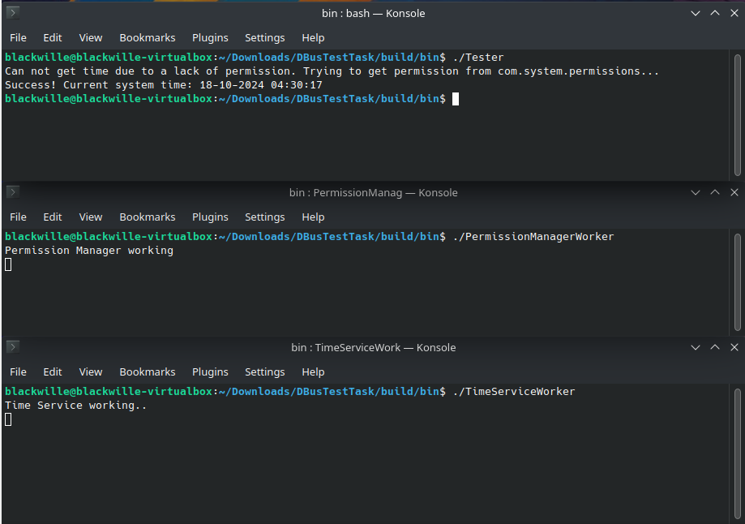

# DBusTestTask

## Пояснения по времени выполнения задания и его наполнению
Приветствую читателя! Собственно, это тестовое задание по DBus.  

Заранее извиняюсь за задержку, на то было несколько причин:  
1. Сейчас высокая занятость и время мог выделять только по вечерам, в отсуствии выходных;
2. Я не знаком был с технологией DBus и потому пришлось для начала изучать ее, а потом уже и библиотеку по ней;
3. В последнее время я не разрабатывал самостоятельных проектов на C++, потому заново пришлось вспоминать CMake. На работе же с ним почти не соприкасаюсь;
4. Для удобства сборки читателя вспомнил про одну из штук из прошлого опыта работы: пакетный менеджер Conan. Потратив на это некоторое время, установка зависимостей программы теперь делается буквально одной командой;

Также стоит отметить, что не хватило времени для написания UT, хотя и в требованиях этого не было.  
Еще стоит отметить, что комментариев практически нет. Это сделано умышленно из-за недостатка времени и стремлении писать более удобные названия без лишних пояснений.  

Устройство проекта довольно простое:  
- PermissionManager - сущность соответствующего сервиса. Сделал ее, как и другую, синглтоном, цикл исполнения которого асинхронно стартует вместе с созданием;
- TimeService - тоже сущность соответствующего заданию сервиса;
- Worker'ы - исполняемые файлы, самих сервисов (отображают выполнение и задают бесконечный цикл);
- Tester - сама программа для получения времени. Понятное дело, что ее нужно запустить только после того, как воркеры обоих сервисов запущены.

## Сборка проекта

### Установка инструментов
Для сборки сначала нужно установить все необходимые tool'ы.  
Если брать пакетный менеджер apt из Kubuntu 22 LTS, то команда *примерно* такая:
```Bash
$ sudo apt install python3 python3-pip gcc g++ cmake make git
```
Собственно, непонятно может быть только зачем тут питон и его пакетный менеджер. А нужны они для установки пакетного менеджера conan:
```Bash 
$ pip install conan
```
Далее сгенерируем профиль conan автоматически (если, конечно, он еще не сгенерирован):
```Bash
$ conan profile detect --force
```

### Сама сборка
Понятно, для начала клонируем в удобную директорию:
```Bash
$ git clone https://github.com/blackwille/DBusTestTask
```
Далее, обязательно(желательно) исполнять команды из директорий, в которых они лежат, то есть сначала перейти через cd, а потом уже запустить.  
Пример перехода к директории скриптов:  
```Bash
$ cd DBusTestTask/scripts
```
Далее, скрестив пальцы(хотя у меня нормально все получалось на голой убунте), устанавливаем все библиотеки с помощью conan:
```Bash
$ ./install_deps.sh
```
Если все окей, а скорее всего все окей, запускаем уже скрипт сборки(можно и использовать сгенерированный conan'ом cmakepreset, но в тулчейне конана по умолчанию не было прописано экспорта compile_commands.json для нормальной работы clangd, потому написал обертку):
```Bash
$ ./build.sh
```
Все! Проект собран!  
Бинари лежат в /build/bin (запускать лучше их тоже только из своих папок, иначе БД sqlite может записаться куда угодно из-за относительного пути (понятное дело, что это можно исправить аргументом командной строки или конфигом, но пока что так))  
Переходим в директорию бинарников:  
```Bash
$ cd ../build/bin
```
Далее, в разных терминалах, либо на фоне надо запустить оба сервиса:
```Bash
$ ./PermissionManagerWorker
```
```Bash
$ ./TimeServiceWorker
```
И, когда запущены, можно уже запускать сам тестер получения времени:
```Bash
$ ./Tester
```
Картинка по итогу должна быть такая:  
